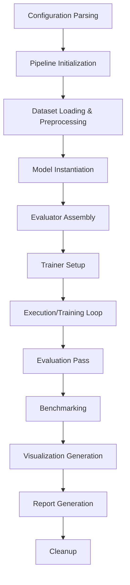

<div align="center">

# Modern NLP Systems Framework
**A production-grade modular NLP framework built from the Sentence Transformers ecosystem, progressively extending into transformer classification, parameter-efficient LLM fine-tuning, dense retrieval, reranking, Retrieval-Augmented Generation (RAG), and Model Context Protocol (MCP).**

[](https://www.python.org/downloads/release/python-390/)
[](https://pytorch.org/)
[](https://github.com/huggingface/transformers)
[](https://sbert.net/)
[](https://opensource.org/licenses/Apache-2.0)
[](https://github.com/)
[](#)

</div>

<br>

## 2. Project Vision
Modern NLP engineering has moved beyond standalone Jupyter notebooks and unorganized scripts. The goal of this framework is to establish a **unified engineering ecosystem** that mirrors real-world production NLP systems. 

Instead of isolating individual machine learning capabilities, every module in this repository shares a hardened, modular core:
- **Common Architecture**
- **Common Pipeline**
- **Common Trainer**
- **Common Evaluation**
- **Common Reporting**

This ensures that whether you are fine-tuning a BERT classifier or training a PEFT LLM via QLoRA, the API remains functionally identical, fully typed, and production-ready.

---

## 3. Architecture Overview
The framework is built using a strict layered architecture, separating core orchestration logic from ML business logic.

```text
┌────────────────────────────────────────────────────────┐
│                   Application Layer                    │
│      (Train Configs, User APIs, Entry Scripts)         │
└───────────────────────────┬────────────────────────────┘
                            │
┌───────────────────────────▼────────────────────────────┐
│                    Pipeline Layer                      │
│ (BasePipeline, PipelineContext, Lifecycle Management)  │
└───────────────────────────┬────────────────────────────┘
                            │
┌───────────────────────────▼────────────────────────────┐
│                  Training Framework                    │
│         (BaseTrainer, Distributed Operations)          │
└────────┬──────────────────┬───────────────────┬────────┘
         │                  │                   │
┌────────▼───────┐ ┌────────▼───────┐ ┌─────────▼────────┐
│     Models     │ │    Datasets    │ │    Evaluation    │
│  (BaseModel)   │ │ (BaseDataset)  │ │ (BaseEvaluator)  │
└────────┬───────┘ └────────────────┘ └─────────┬────────┘
         │                                      │
┌────────▼──────────────────────────────────────▼────────┐
│                  Post-Run Analytics                    │
│      (Reporting, Benchmarking, Visualizations)         │
└───────────────────────────┬────────────────────────────┘
                            │
┌───────────────────────────▼────────────────────────────┐
│                      Utilities                         │
│   (Registry, Checkpoints, Config, Metrics, Hardware)   │
└────────────────────────────────────────────────────────┘
```

The structural backbone revolves around abstract base classes. Extending the framework only requires subclassing: `BaseTrainer`, `BaseModel`, `BaseDataset`, `BaseEvaluator`, and `BasePipeline`. The entire state is gracefully passed via dependency injection using the `PipelineContext`.

---

## 4. Current Repository Structure

```text
modern_nlp/
├── core/                  # Shared framework abstractions (BasePipeline, PipelineContext, etc.)
├── embeddings/            # Sentence Transformer fine-tuning and inference
├── classification/        # (Upcoming) Sequence Classification workflows
├── benchmarks/            # Throughput, latency, and resource profiling
├── visualization/         # Multi-format PCA, UMAP, TSNE generators
├── reporting/             # End-to-end Markdown, HTML, and JSON experiment reporters
├── metrics.py             # Global metric computation logic
├── config.py              # Centralized Pydantic validation for configs
├── registry.py            # Component registry
└── hardware.py            # Platform agnostic (CUDA, MPS, CPU) device allocation
```

---

## 5. Features Implemented

- [x] **Framework Layer**: Robust OOP design replacing scripts.
- [x] **Configuration**: Pydantic-validated YAML config handling.
- [x] **Logging**: Centralized, formatted colored loggers.
- [x] **Experiment Tracking**: Integration with TensorBoard and W&B.
- [x] **Checkpointing**: CheckpointManager with limit policies.
- [x] **Callbacks**: Early stopping and dynamic learning rate schedulers.
- [x] **Dependency Injection**: Unified `PipelineContext`.
- [x] **Trainer Framework**: Extensible `BaseTrainer` wrapper over HF Trainer.
- [x] **Embedding Framework**: Full fine-tuning ecosystem for Sentence Transformers.
- [x] **Evaluation Framework**: Sequential multi-metric evaluation arrays.
- [x] **Benchmark Framework**: Profiling throughput, latency, and memory allocation.
- [x] **Visualization Framework**: Dimensionality reduction (PCA, UMAP, t-SNE) and heatmaps.
- [x] **Reporting Framework**: Automated final artifact aggregation (JSON/MD/HTML).

---

## 6. Development Roadmap

| Module | Description | Status | Progress |
|:---|:---|:---:|:---:|
| **Core Framework** | Pipeline, Context, Configs, Checkpoints | 🟢 Active | 100% |
| **Sentence Embeddings** | Contrastive training, Evaluation, Benchmarks | 🟢 Active | 100% |
| **Transformer Classification** | Sequence/Token Classification pipelines | 🟡 Pending | 0% |
| **QLoRA** | Parameter-Efficient Fine-Tuning for LLMs | 🔴 Planned | 0% |
| **Dense Retrieval** | Vector Indexing and similarity search | 🔴 Planned | 0% |
| **Cross Encoder** | Reranking and pairwise scoring | 🔴 Planned | 0% |
| **RAG** | Retrieval-Augmented Generation workflows | 🔴 Planned | 0% |
| **MCP Server** | Model Context Protocol integration | 🔴 Planned | 0% |

---

## 7. Current Progress: Milestone Tracker

<details>
<summary><b>Milestone 1: Foundations & Embeddings (Completed)</b></summary>

- Core Framework built (Pipelines, Trainers, Datasets)
- Sentence Embedding fine-tuning operational
- Automated Benchmarking profiling
- Visualization dimensionality reduction
- HTML/Markdown Reporting
</details>

<details>
<summary><b>Milestone 2: Classification (Next)</b></summary>

- Migrate text classification to use `BasePipeline`.
- Implement `ClassificationEvaluator`.
</details>

<details>
<summary><b>Milestone 3: QLoRA (Upcoming)</b></summary>

- Integrate PEFT.
- Implement 4-bit/8-bit quantization configurations.
</details>

<details>
<summary><b>Milestone 4: Retrieval & Reranking (Upcoming)</b></summary>

- Build Dense Retrieval indices (FAISS).
- Implement Cross-Encoder reranking pipelines.
</details>

<details>
<summary><b>Milestone 5: RAG + MCP (Upcoming)</b></summary>

- Connect Retrieval to Generation.
- Implement FastMCP server for context injection.
</details>

---

## 8. Core Components

- **`BasePipeline`**: The primary orchestrator. Executes `initialize`, `before_run`, `run`, `after_run`, and `cleanup` hooks.
- **`PipelineContext`**: A dynamic dataclass acting as a dependency injection container holding configs, models, and datasets.
- **`BaseTrainer`**: Wraps the underlying HuggingFace `Trainer` to handle custom callbacks and metrics.
- **`BaseModel`**: Abstract interface guaranteeing forward pass signatures.
- **`CheckpointManager`**: Controls disk I/O for saving checkpoints and pruning stale weights.
- **`Configuration System`**: `TrainConfig` uses strict Pydantic definitions ensuring runtime safety against invalid hyperparameters.

---

## 9. Pipeline Flow

Every executed pipeline unconditionally adheres to this strict chronological execution flow:



---

## 10. Technology Stack

| Domain | Technologies |
|:---|:---|
| **Language** | Python 3.9+ |
| **Deep Learning** | PyTorch |
| **Ecosystem** | HuggingFace Transformers, Datasets, Evaluate |
| **Embeddings** | Sentence Transformers |
| **Tracking** | TensorBoard, Weights & Biases |
| **Future Integration** | PEFT, TRL, FAISS, Flash Attention, FastMCP |

---

## 11. Engineering Principles

This repository strictly enforces:
- **SOLID Principles**: Components are isolated with single responsibilities.
- **Dependency Injection**: Nothing is hardcoded; context flows via `PipelineContext`.
- **Pipeline Architecture**: Business logic is separated from operational execution loops.
- **Configuration Driven**: Execution variables are injected via external YAML configurations.
- **Type Safety**: Aggressive use of `typing` annotations and Pydantic validation.
- **Reproducibility**: Random seed locking across datasets and CUDA operations.

---

## 12. Future Work

Beyond completing the NLP module roadmap (QLoRA, RAG), future operational tasks include:
- **Deployment**: Exposing artifacts natively via FastAPI.
- **Containerization**: Wrapping execution contexts inside Docker.
- **CI/CD**: Automating `pytest` workflows and static analysis hooks.

---

## 13. Installation

### Environment Setup
```bash
# Clone the repository
git clone https://github.com/your-org/modern-nlp.git
cd modern-nlp

# Create a virtual environment
python3 -m venv .venv
source .venv/bin/activate

# Install dependencies
pip install torch torchvision torchaudio
pip install transformers datasets evaluate sentence-transformers
pip install pydantic pyyaml matplotlib seaborn scikit-learn
pip install pytest
```

---

## 14. Usage

To run the full end-to-end Embedding fine-tuning pipeline (Training, Benchmarking, Visualization, and Reporting):

```bash
python -m modern_nlp.embeddings.train \
    --model_config modern_nlp/configs/model.yaml \
    --train_config modern_nlp/configs/train.yaml
```

*Results will automatically propagate into the configured `output_dir` (default: `checkpoints/`), yielding weights, markdown reports, benchmark datasets, and visualizations.*

---

## 15. Progress Dashboard

| Domain | Progress |
|:---|---:|
| **Overall Project Completion** | **25%** ⬛⬛⬜⬜⬜⬜⬜⬜⬜⬜ |
| Core Framework | 100% 🟩🟩🟩🟩🟩🟩🟩🟩🟩🟩 |
| Embedding Module | 100% 🟩🟩🟩🟩🟩🟩🟩🟩🟩🟩 |
| Classification Module | 0% ⬜⬜⬜⬜⬜⬜⬜⬜⬜⬜ |
| QLoRA Fine-tuning | 0% ⬜⬜⬜⬜⬜⬜⬜⬜⬜⬜ |
| Dense Retrieval | 0% ⬜⬜⬜⬜⬜⬜⬜⬜⬜⬜ |
| RAG Systems | 0% ⬜⬜⬜⬜⬜⬜⬜⬜⬜⬜ |
| MCP Integration | 0% ⬜⬜⬜⬜⬜⬜⬜⬜⬜⬜ |

---

## 16. Contributing

Contributions are welcome. Please ensure that:
1. New modules subclass `BasePipeline` and `BaseTrainer`.
2. All inputs are validated via Pydantic.
3. Tests are provided in `tests/modern_nlp/`.
4. Docstrings strictly follow Google formatting standards.

## 17. License

This project retains the Apache 2.0 License inherited from the foundational Sentence Transformers framework. See `LICENSE` for more details.
