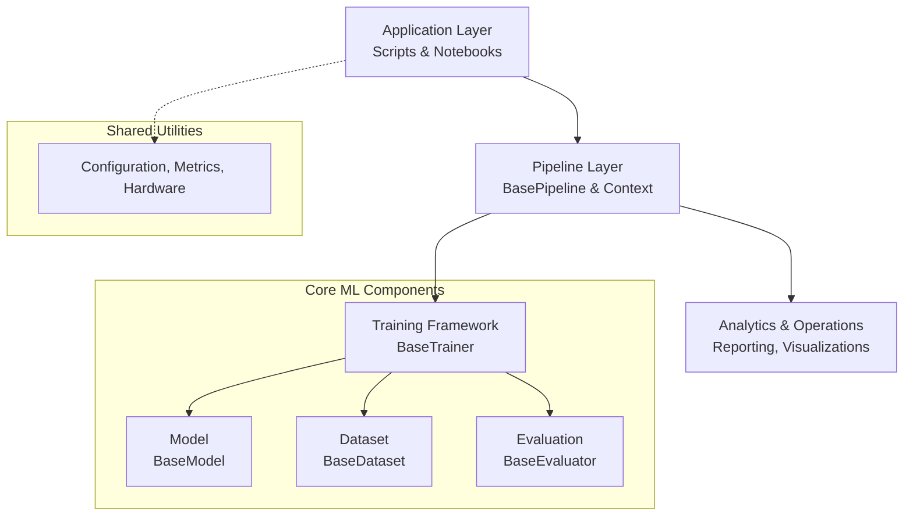
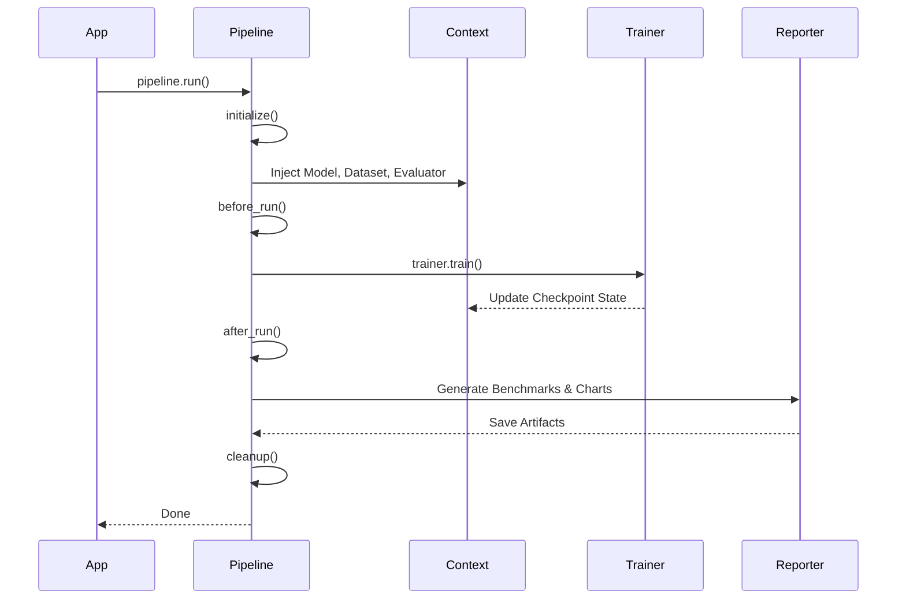

# Architecture Overview

## Purpose
This document provides a macroscopic view of the Modern NLP Systems Framework. Unlike standalone scripts, this framework utilizes a strict layered architecture designed for modularity and dependency injection.

## High-Level Architecture

The framework consists of distinct tiers, ensuring ML business logic is separated from orchestration and execution.

## Layered Execution Flow

The heart of the framework is the `BasePipeline`. When an application executes the pipeline, it orchestrates the components through a rigorous lifecycle.

## Core Abstractions
To guarantee conformity, all future modules must inherit from these abstract base classes:
- **`BasePipeline`**: The orchestrator.
- **`PipelineContext`**: The global state container injected across components.
- **`BaseTrainer`**: Handles loop execution, backward passes, and gradient aggregation.
- **`BaseModel`**: Defines strict signatures for `forward()` and `encode()`.
- **`BaseDataset`**: Standardizes tokenization mapping and batch extraction.
- **`BaseEvaluator`**: Assembles sequential metric computation arrays.

## Extension Points
Adding a new capability (e.g., [Classification](classification_module.md)) only requires subclassing these 6 base objects. The entire post-run reporting, benchmarking, and visualization layer comes completely free via inheritance.

## Future Work
- Hardening the distributed communication abstractions inside `BaseTrainer` for Multi-GPU training.
- Integrating Docker/Kubernetes primitives natively into the `PipelineContext`.
