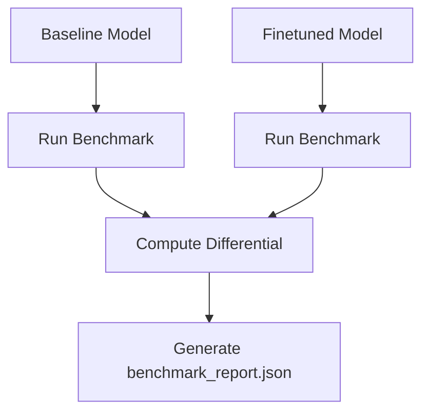

# Benchmarking Philosophy

## Purpose
In production NLP, accuracy (e.g., F1, NDCG) is only half the battle. If a model takes 500ms to process a query, it is un-deployable in real-time systems. The Benchmarking subsystem exists to provide rigorous hardware profiling.

## Architecture
The benchmark runner sits natively inside the `BasePipeline`'s `after_run()` hook.

### Key Metrics Tracked
- **Training Benchmarks**: Throughput (samples/sec) during the forward/backward passes.
- **Inference Benchmarks**: Encoding time (sec/batch).
- **Latency**: P50, P90, P99 latency bounds.
- **Memory Benchmarks**: Peak VRAM allocation (MB).

## Evaluation Diffs
The benchmarking system is specifically designed to compare a `fine-tuned` checkpoint against a `baseline` checkpoint. 

## Future Benchmark Reports
We intend to implement automated regression testing where PRs fail if latency increases by > 10% on a standard dataset.
