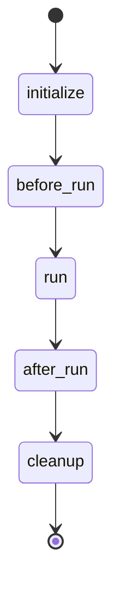

# The Reusable Framework

## Purpose
This document details the shared engineering primitives that power every module in the Modern NLP Systems repository. By standardizing configuration, context management, and lifecycles, we ensure high experiment reproducibility and low boilerplate.

## Architecture & Key Components

### 1. Configuration System
The framework completely rejects untyped dictionary configurations. Every experiment is backed by strict Pydantic definitions (e.g., `TrainConfig`).
- Validates hyperparameter bounds instantly.
- Parses hierarchical YAML files cleanly.

### 2. Dependency Injection & Context Management
Instead of passing twelve arguments between functions, we pass a single `PipelineContext`.
- Acts as an intelligent dataclass container.
- Holds `train_config`, `model`, `train_dataset`, `evaluator`, and the active `trainer`.
- Ensures zero coupling between individual components; they only speak to the context.

### 3. Pipeline Lifecycle
The `BasePipeline` is a Template Method pattern.

- `initialize()`: Build datasets, models, evaluators, and the trainer.
- `before_run()`: Execute sanity checks or dry runs.
- `run()`: The heavy compute load (Training/Inference).
- `after_run()`: Compute benchmarks, draw visual PCA plots, generate Markdown reports.
- `cleanup()`: Free CUDA memory and drop pointers.

### 4. Logging & Experiment Tracking
- Handled natively by a central logger mapped directly into HuggingFace `Trainer` tracking capabilities (TensorBoard, Weights & Biases).

### 5. Checkpointing
- `CheckpointManager` manages saving strategies (step-based or epoch-based).
- Automatically prunes stale weights to preserve disk space based on `save_total_limit`.

## Extension Points
You can easily inject custom Callbacks via the `BaseTrainer` (e.g., custom EarlyStopping criteria). 
The `PipelineContext` allows dynamic injection of new fields if future modules require arbitrary state tracking.

## Future Work
- Integration with external workflow orchestration engines (e.g., Apache Airflow, Prefect).
- Cloud storage integration for CheckpointManager (S3/GCS syncing).
