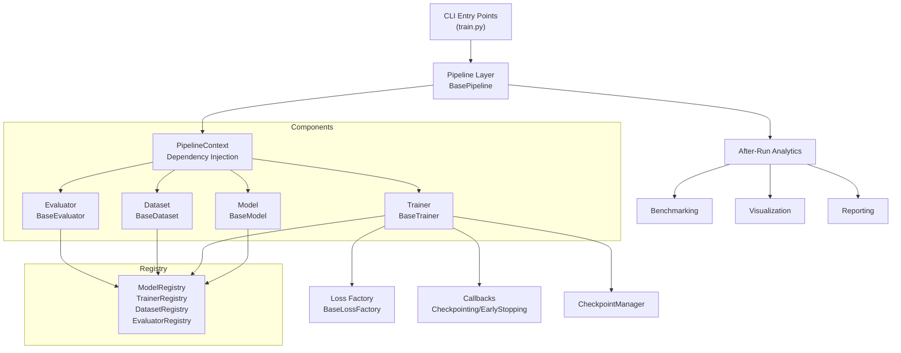
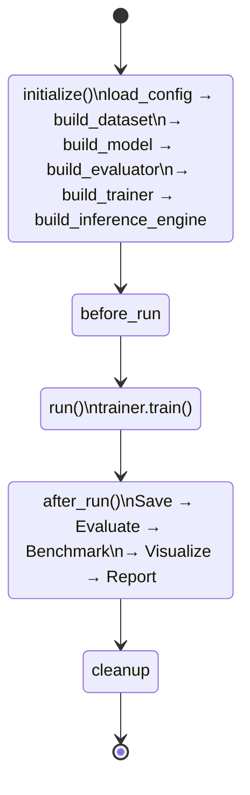
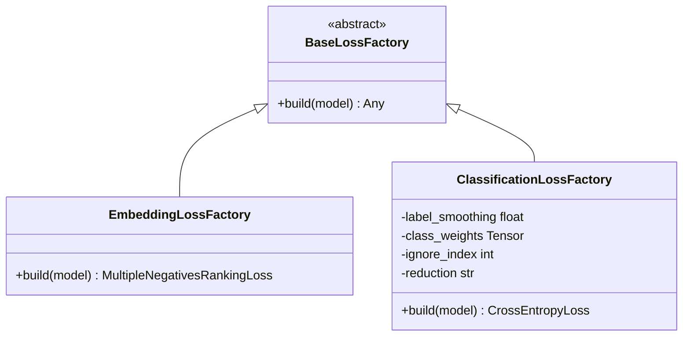
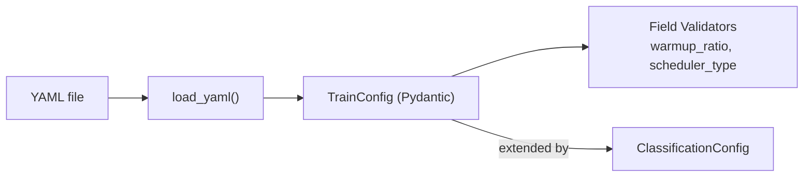

# Architecture Changes

**Purpose:** Documents every significant architectural evolution of the repository.  
**Audience:** Senior engineers and architects reviewing the framework design.  
**Scope:** Covers the transformation from the original Sentence Transformers repo to the current state.  
**Last Updated:** 2026-07-09

---

## Original Architecture

The repository began as the upstream `sentence-transformers` Python library. Its structure was:

```text
sentence_transformers/       # upstream library package
examples/                    # standalone Python scripts
tests/                       # original upstream tests
```

Training was performed via isolated Python scripts with no shared abstractions. Every example script was self-contained, making code reuse between NLP tasks (embeddings vs. classification) essentially impossible.

---

## Current Architecture



---

## Layer-by-Layer Changes

### 1. Abstract Base Classes (ABCs)

**Before:** No shared interfaces. Each example had its own model, dataset, trainer logic.

**After:** `core/` package defines:
- `BaseModel` — `backbone` property, `save()`, `load()`
- `BaseDataset` — `load()`, `validate()`, `preprocess()`
- `BaseTrainer` — full training loop, callbacks, checkpoints
- `BaseEvaluator` — `__call__()`, `_save_metrics()`, `_log_metrics()`

All current modules (`embeddings/`, `classification/`) strictly subclass these ABCs.

---

### 2. Pipeline Introduction

**Before:** Training scripts orchestrated everything inline.

**After:** `BasePipeline` enforces the **Template Method pattern**:



The pipeline owns orchestration. Components own computation. They never intersect.

---

### 3. PipelineContext (Dependency Injection)

**Before:** Components passed via function arguments across dozens of call sites.

**After:** `PipelineContext` is a single dataclass that travels through the pipeline:

```python
@dataclass
class PipelineContext:
    model_config_path: str
    train_config_path: str
    model_config: Optional[Any] = None
    train_config: Optional[TrainConfig] = None
    train_dataset: Optional[Dataset] = None
    val_dataset: Optional[Dataset] = None
    model: Optional[BaseModel] = None
    evaluator: Optional[BaseEvaluator] = None
    trainer: Optional[BaseTrainer] = None
    inference_engine: Optional[Any] = None
    report_generator: Optional[Any] = None
```

Every component reads what it needs from the context; the pipeline populates it step by step.

---

### 4. Registry Pattern

**Before:** Components were hardcoded in scripts.

**After:** A generic `Registry` class allows decorator-based registration:

```python
@ModelRegistry.register("EmbeddingModel")
class EmbeddingModel(BaseModel): ...

@ModelRegistry.register("ClassificationModel")
class ClassificationModel(BaseModel): ...
```

Current registered components:

| Registry | Members |
|:---|:---|
| `ModelRegistry` | `ClassificationModel` |
| `TrainerRegistry` | `EmbeddingTrainer`, `ClassificationTrainer` |
| `DatasetRegistry` | `EmbeddingDataset`, `ClassificationDataset` |
| `EvaluatorRegistry` | `ClassificationEvaluator` |

---

### 5. Loss Factory Abstraction

**Before:** Loss functions were instantiated directly inside `EmbeddingTrainer.build_loss()`.

**After:** `BaseLossFactory` ABC is introduced. Each module provides its factory:



`BaseTrainer.build_loss()` is now an abstract method delegating to a factory. This ensures future loss functions (e.g., `QLoRALossFactory`) can be added without touching `BaseTrainer`.

---

### 6. Configuration System

**Before:** Hyperparameters were `argparse` arguments in scripts.

**After:** Pydantic models loaded from YAML:



`TrainConfig` covers ~25 standard training hyperparameters. `ClassificationConfig` adds `num_labels`, `label_smoothing`, `use_class_weights`, `dataset_name`.

---

### 7. Evaluation System

**Before:** Evaluation was tightly coupled inside the Trainer.

**After:** `BaseEvaluator` is a standalone unit. The `EmbeddingEvaluator` assembles a `SequentialEvaluator` chain:

```
InformationRetrievalEvaluator → EmbeddingSimilarityEvaluator → ParaphraseMiningEvaluator
```

`ClassificationEvaluator` is a `compute_metrics` callable producing Accuracy, F1 (macro/micro/weighted), per-class metrics, and confusion matrices.

---

### 8. Checkpoint System

**Before:** `model.save()` was called ad-hoc inside training scripts.

**After:** `CheckpointManager` centralizes all checkpoint logic:
- Enforces `max_to_keep` disk policies
- Resolves latest checkpoint for resume
- Decoupled from Trainer via `CheckpointCallback`

---

### 9. Reporting & Analytics

**Before:** No automated reporting.

**After:** Post-training analytics pipeline:

| Component | Output |
|:---|:---|
| `MetricsManager` | `eval_results.json`, `eval_results.csv`, `eval_results.md` |
| `ExperimentReportGenerator` | `report.html`, `report.md`, `report.json` |
| `EmbeddingVisualizer` | PCA/t-SNE/UMAP PNGs, SVGs, similarity heatmaps |
| Benchmark system | `benchmark_report.json`, `benchmark_report.md` |

All analytics are triggered in `BasePipeline.after_run()` and are entirely optional via configuration flags.
