# MCP Server Module (Planned)

> [!WARNING]
> This module is currently planned for development and is not yet available in the main branch.

## Purpose
The Model Context Protocol (MCP) Module will expose the entire framework as an interactive tool server. This allows AI assistants and IDEs (like Claude or Windsurf) to natively invoke our ML pipelines as tools.

## Architecture & Integration
By leveraging FastMCP or a similar SDK, we will wrap our pipelines in `@mcp.tool()` decorators.

```mermaid
graph LR
    IDE[AI IDE / Client] <-->|JSON-RPC via stdio/HTTP| Server[MCP Server]
    Server -->|Invoke| Search[Retrieval Tool]
    Server -->|Invoke| Embed[Embedding Tool]
    Server -->|Invoke| RAG[RAG Tool]
```

## Available Tools (Planned)
- `search_documents(query)`: Invokes the Retrieval index.
- `classify_text(text)`: Invokes the Classification inference endpoint.
- `embed_text(text)`: Returns dense vectors.
- `generate_rag_response(query)`: Executes the full RAG pipeline and returns streamed answers.

## Future IDE Integration
This module will fundamentally shift the framework from a backend execution engine to an interactive, agentic service.
