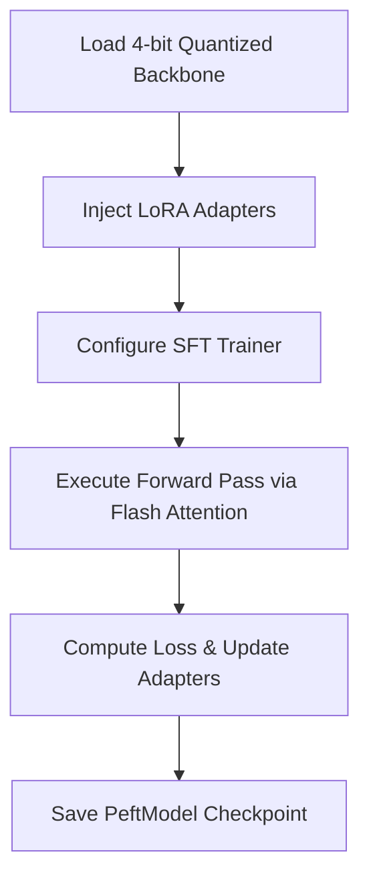

# QLoRA Module (Planned)

> [!WARNING]
> This module is currently planned for development and is not yet available in the main branch.

## Purpose
The QLoRA Module will integrate Parameter-Efficient Fine-Tuning (PEFT) techniques, enabling the training of massively large language models (LLMs) on consumer-grade hardware via aggressive quantization.

## Architecture & Concepts

### LoRA & QLoRA
By utilizing Low-Rank Adaptation (LoRA), we only train specific, small rank decomposition matrices injected into the attention blocks, freezing the massive pretrained weights. QLoRA further pushes this by quantizing the frozen weights into 4-bit NormalFloat formats using the `bitsandbytes` library.

### Flash Attention & Gradient Checkpointing
To maximize throughput and context length, Flash Attention 2 will be natively injected. Gradient Checkpointing will trade compute for VRAM, allowing vastly deeper network passes on limited GPUs.

### TRL Ecosystem
We intend to leverage the HuggingFace `trl` (Transformer Reinforcement Learning) library to facilitate SFT (Supervised Fine-Tuning) and potentially DPO (Direct Preference Optimization).

## Execution Flow

## Implementation Roadmap
This sits at Milestone 3 in our [Roadmap](roadmap.md), post-Classification.
