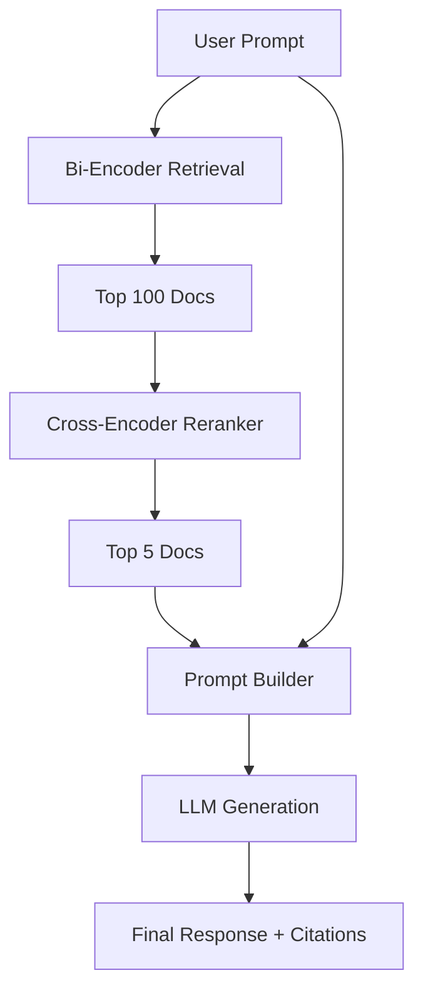

# RAG Module (Planned)

> [!WARNING]
> This module is currently planned for development and is not yet available in the main branch.

## Purpose
The Retrieval-Augmented Generation (RAG) module represents the ultimate combination of the framework's capabilities. It fuses the [Retrieval](retrieval_module.md), [Reranking](reranking_module.md), and [QLoRA](qlora_module.md) modules into a single generative pipeline.

## End-to-End Architecture

## Key Components

- **Retriever**: Fetches relevant context dynamically.
- **Prompt Builder**: Injects context strings into templated LLM instruction formats cleanly to prevent context window overflow.
- **LLM**: The generative engine (likely loaded via PEFT/QLoRA if running locally, or routed to external APIs).
- **Memory**: Conversation history buffer.
- **Streaming**: Token-by-token generation routing to clients.
- **Citation Generation**: Appending source indices to generated facts.

## Evaluation
RAG evaluation is complex. We intend to use frameworks like RAGAS or TruLens to evaluate Faithfulness, Answer Relevance, and Context Precision.
