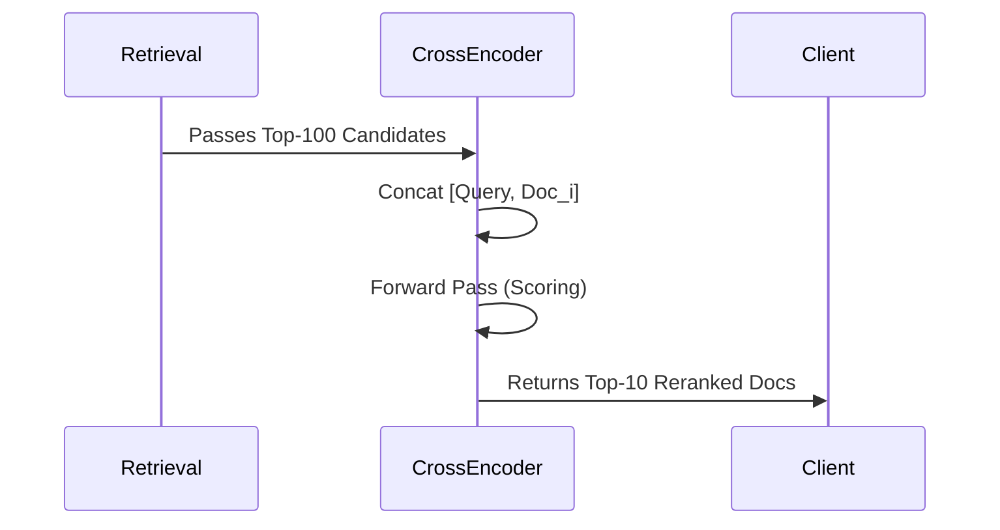

# Reranking Module (Planned)

> [!WARNING]
> This module is currently planned for development and is not yet available in the main branch.

## Purpose
The Reranking Module will provide Cross-Encoder models. While bi-encoders (Dense Retrieval) are fast, they lack deep semantic interactions between query and document. Cross-encoders solve this by concatenating the query and document and feeding them through the transformer simultaneously.

## Execution Flow

## Architecture
- **`RerankerPipeline`**: Chains onto the output of the `RetrievalPipeline`.
- **Hybrid Retrieval**: Ultimately, this module will be utilized in a two-stage retrieval pipeline: Sparse (BM25) / Dense (FAISS) -> CrossEncoder Reranker.

## Key Considerations
- **Latency**: Cross-encoders are incredibly slow compared to bi-encoders. Benchmarking latency per candidate will be critical.
- **Metrics**: NDCG@10, MRR@10.
