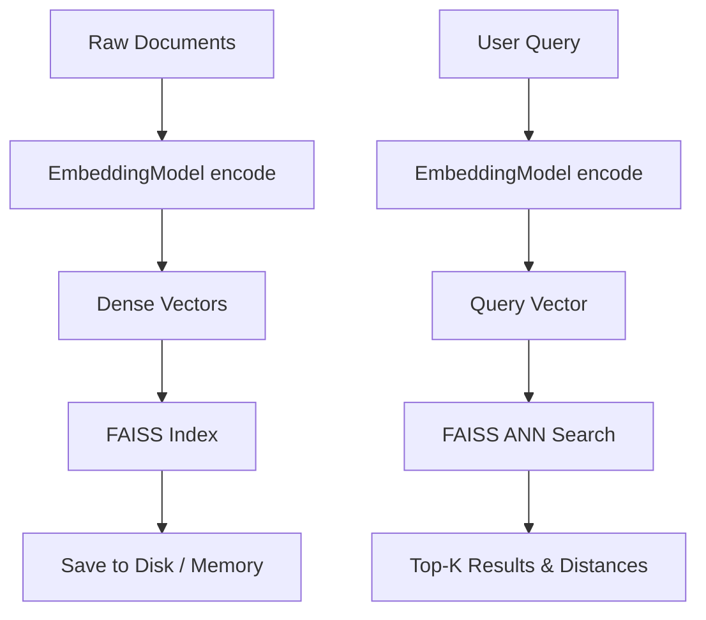

# Retrieval Module (Planned)

> [!WARNING]
> This module is currently planned for development and is not yet available in the main branch.

## Purpose
The Retrieval Module will construct high-performance dense vector search indices using FAISS. This will bridge the gap between training [Embeddings](embedding_module.md) and executing large-scale document searches.

## Architecture

- **`RetrievalPipeline`**: Manages indexing and querying.
- **Indexers**: Wrappers around FAISS (FlatL2, HNSW, IVFPQ).
- **Metadata Persistence**: Tying raw strings and database IDs back to dense vector hashes.

## Execution Flow

## Key Technologies
- **FAISS**: Facebook AI Similarity Search.
- **ANN (Approximate Nearest Neighbors)**: For sub-millisecond retrieval across million-scale corpora.

## Future Implementation Plan
This will act as the foundational indexing layer required for the subsequent [RAG Module](rag_module.md).
